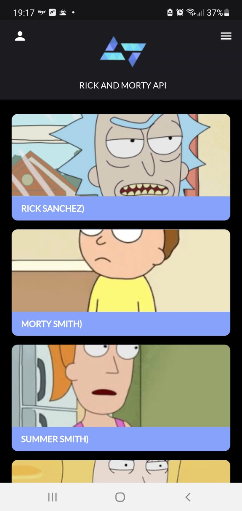
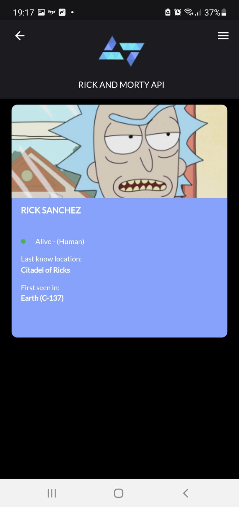

<h1 align="center">Rick and Morty API</h1>

Projeto desenvolvido para testar e aplicar os conteúdos estudados no projeto Kobe Start

<h1 align="center">
    <a href="https://flutter.dev/?gclid=Cj0KCQiA-qGNBhD3ARIsAO_o7ykvsTlMbLZLCzT_OrzKAYlKthVLQEIC-xU8mM5SD7u7L3QCTVb67aQaAh82EALw_wcB&gclsrc=aw.ds">🔗 Flutter</a>
</h1>

🚀 O objetivo deste projeto é priorizar o uso da versão REST da API, pois é uma implementação mais
utilizada no mercado para desenvolvimento de aplicativos.

<h1 align="center">HomePage</h1>

Na Home Page é apresentado a lista dos 20 primeiros registros de personagens. Contendo nome,
imagem, espécie dos personagens conforme a imagem demonstrativa abaixo:

<h1 align="center">
  
</h1>

<h1 align="center">Details</h1>

Ao selecionar um personagem será apresentado o nome, imagem, espécie, gênero, status,
última localização, localização de origem e primeira aparição do personagem, conforme a imagem demonstrativa abaixo:

<h1 align="center">
  
</h1>

### 🛠 Tecnologias

As seguintes ferramentas foram usadas na construção do projeto:

- [Flutter](https://flutter.dev/)
- [Dart](https://dart.dev/)

